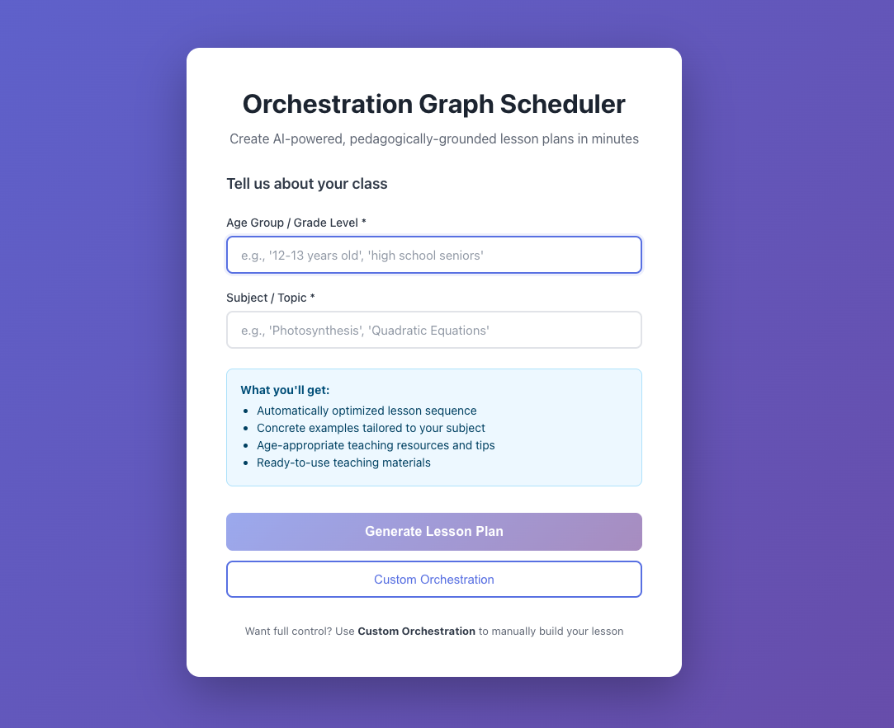
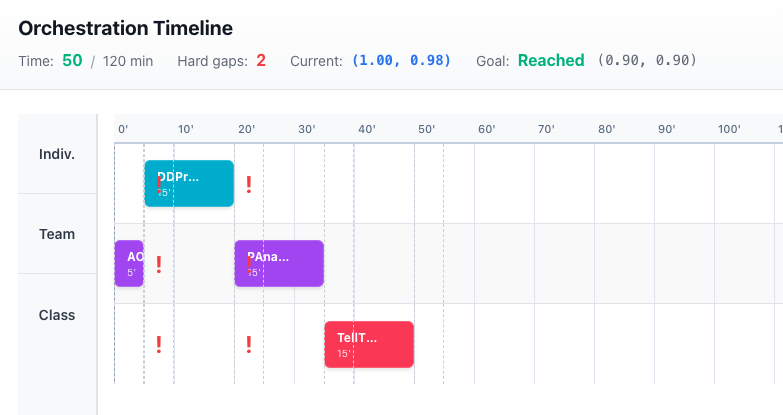
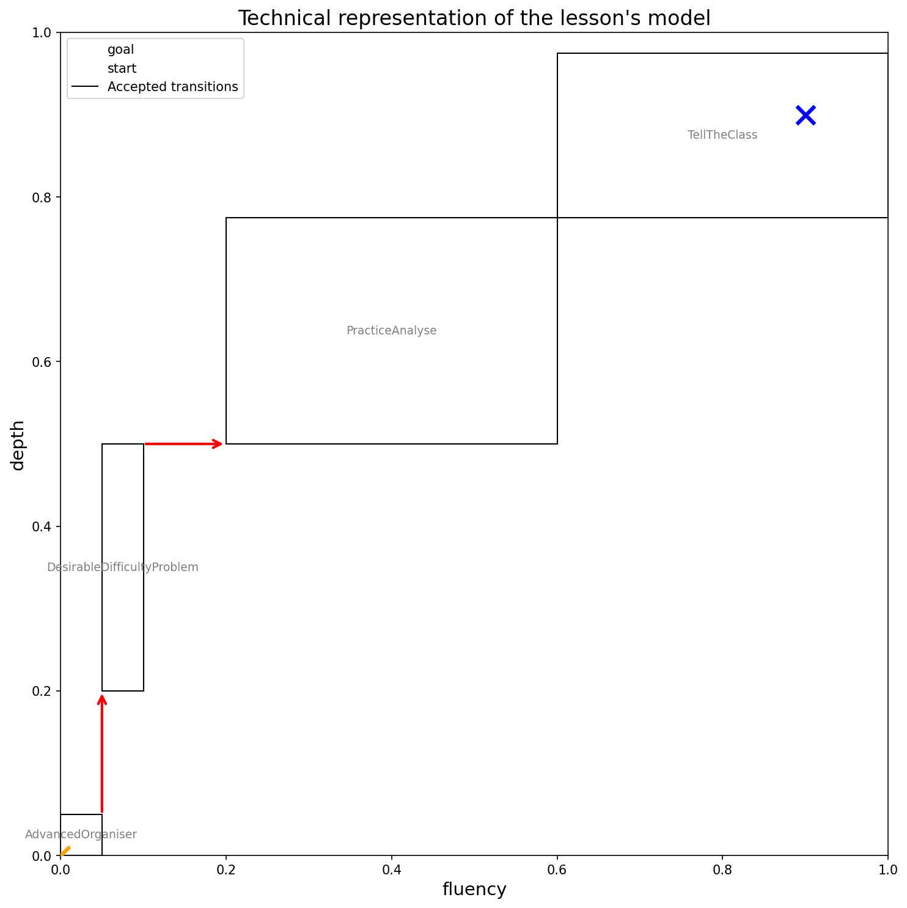
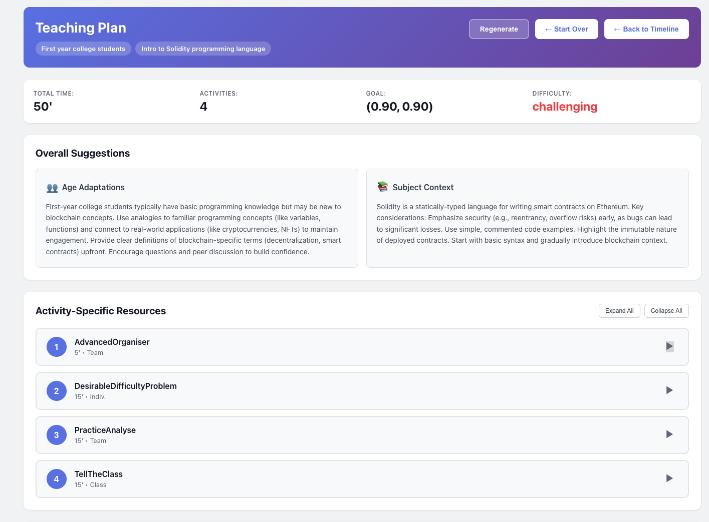
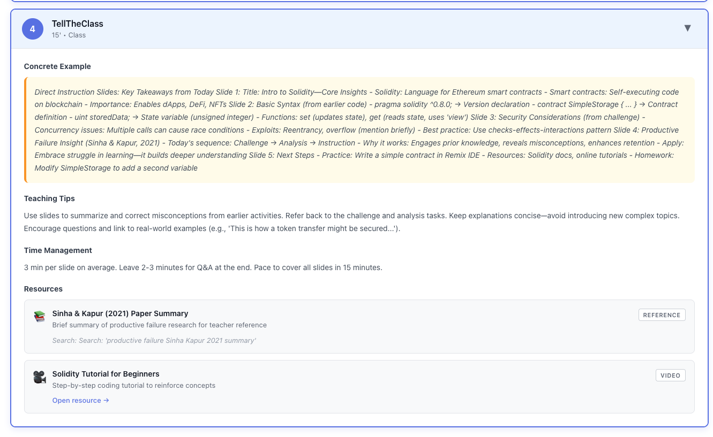

# Orchestration Graph Scheduler

A React TypeScript application for designing educational lesson plans through graph orchestration. This app allows the creation of sequential timelines of learning activities across individual, team, and class organizational planes, with LLM-generated teaching materials.

## Overview

The Orchestration Graph Scheduler helps educators create structured lesson plans by:
- Auto-generating complete lesson plans from age group and subject inputs
- Organizing activities across three organizational levels (Individual, Team, Class)
- Automatically recommending activities to fill learning gaps
- Generating age-appropriate teaching materials with AI (DeepSeek)
- Visualizing lesson progression through state-space graphs
- Ensuring pedagogical constraints are met (time budgets, prerequisites, repetition limits)

## Quick Start

### Prerequisites

- Python 3.8 or higher
- Node.js 16 or higher
- npm or yarn
- DeepSeek API key (for LLM features)

### Installation

1. **Clone the Repository**
```bash
git clone https://github.com/Julkzein/pdb.git
cd pdb
```

2. **Backend Setup**
```bash
pip install -r requirements.txt
```

3. **Frontend Setup**
```bash
cd frontend
npm install
cd ..
```

4. **Environment Variables**
Create a `.env` file in the root directory:
```
DEEPSEEK_API_KEY=your_api_key_here
```

### Running the Application

1. **Start the Backend**:
```bash
python app.py
```
The backend will start on `http://localhost:5000`

2. **Start the Frontend** (in a new terminal):
```bash
cd frontend
npm start
```
The application will open in your browser at `http://localhost:3000`

## Screenshots

### Landing Page


The landing page offers two options: auto-generate a complete lesson plan from age group and subject, or build a custom orchestration manually.

### Orchestration Timeline


Interactive timeline showing activities across three organizational lanes (Individual, Team, Class), with gap analysis and progress tracking toward the learning goal.

### State-Space Visualization


2D visualization showing the learning trajectory through the fluency-depth space, from starting point to goal.

### AI-Generated Teaching Plan


LLM-enhanced teaching materials with age-appropriate resources, concrete examples, and pedagogical guidance.

### Detailed Activity Resources


Activity-specific teaching tips, time management suggestions, and curated resources (videos, worksheets, tools, simulations).

## Two Ways to Use the App

### Auto-Generate Mode (Recommended for Quick Start)

1. On the landing page, enter the **Age Group** of the class you want too teach (e.g., "12-13 years old", "high school seniors")
2. Enter your **Subject/Topic** (e.g., "Photosynthesis", "Quadratic Equations")
3. Click **Generate Lesson Plan**
4. The app will:
   - Automatically build an optimized orchestration
   - Generate teaching materials with concrete examples
   - Provide age-appropriate resources and teaching tips
5. Review your ready-to-use lesson plan

### Custom Orchestration Mode (For Manual Control)

1. Click **Custom Orchestration** from the landing page
2. Manually build your lesson (see "Building a Lesson" below)
3. Click **Go Teach** when ready to generate teaching materials
4. Use **← Back to Start** to return to the landing page

## Using the Application

### Building a Lesson (Custom Mode)

1. **Drag and Drop**: Drag activities from the library panel (right side) onto the timeline
2. **Three Organizational Lanes**:
   - **Individual**: Activities students perform alone
   - **Team**: Collaborative team-based activities
   - **Class**: Whole-class instruction and activities

3. **Sequential Timeline**: Activities are positioned left-to-right by time. The x-axis represents lesson time in minutes.

### Automatic Recommendations

Click "Add Recommended" to automatically add the best activity for the largest learning gap. The system uses an efficiency algorithm to select activities that maximize learning progress per minute.

### Activity Information

Hover over any activity (in the library or timeline) to view:
- Activity description
- Duration and organizational plane
- Time range (for timeline activities)

### Changing Activity Placement

- **Move Between Lanes**: Drag an activity from one lane to another to change its organizational plane
- **Remove Activity**: Hover over an activity and click the × button

### Visualization

Click "Print" to generate a 2D state-space visualization showing the current state of your orchestration graph. 


### Saving and Loading

- **Save**: Click "Save" to save your orchestration graph
- **Load**: Click "Load" to restore a previously saved orchestration

### Reset

Click "Reset" to clear the timeline and start fresh.

## Activity Library

The system includes 10 educational activity type but you may add as many as necessary manually in the custom orchestration graph building. 

## Learning Model

The system models student understanding across two dimensions:
- **Fluency**: Ability to quickly recall and apply knowledge
- **Depth**: Understanding of underlying concepts and relationships

Activities move students through this 2D space from a starting knowledge level to a learning goal.

## Support

For issues or questions, please contact jules.delforge@epfl.ch or @julkzein on telegram. 
